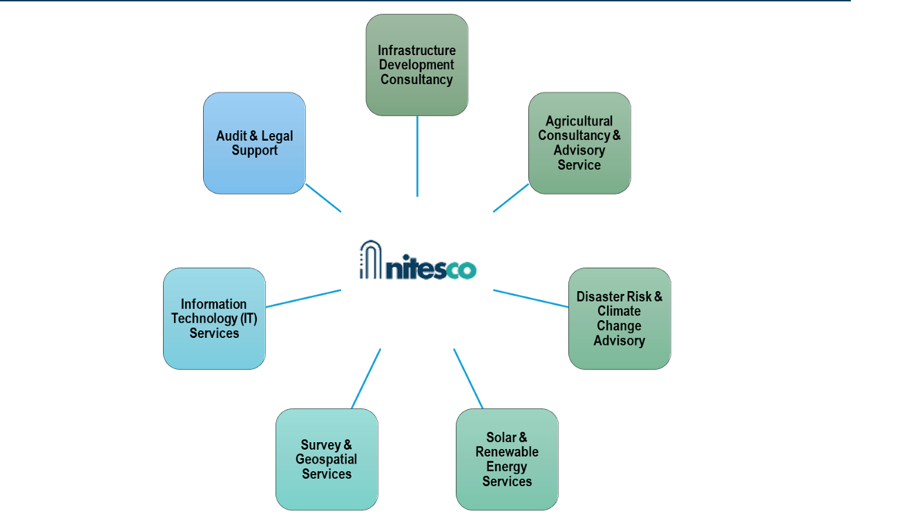
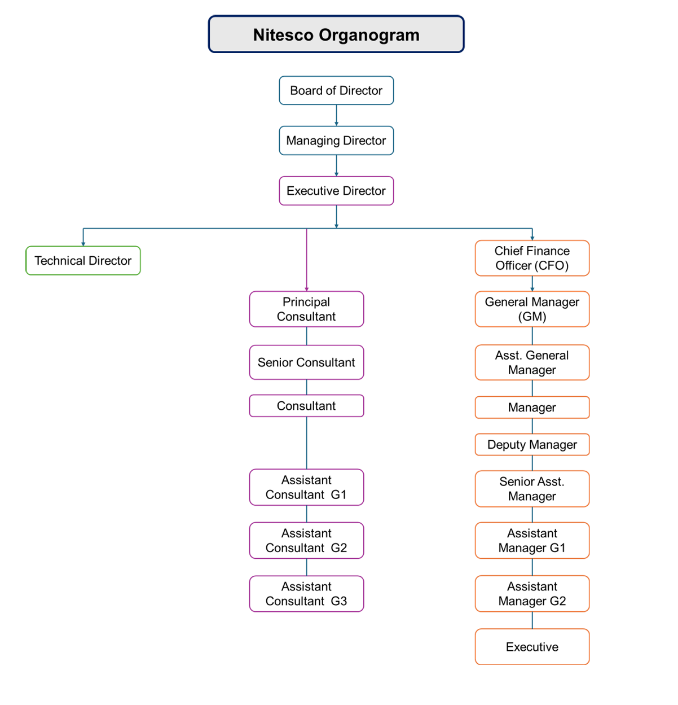
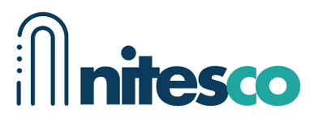

**Company Profile**

Nitesco Tech and Development Limited (Nitesco) is a modern multidisciplinary consultancy and technology
company committed to delivering innovative digital solutions and strategic advisory services to
organizations, businesses, and institutions. Nitesco combines technology expertise with practical business

# insight to help our clients achieve sustainable growth and operational excellence. By integrating advanced



technology expertise with practical business insight, Nitesco enables clients to achieve sustainable growth,
improved performance, and long-term operational excellence.

With a strong commitment to national development and innovation, Nitesco delivers end-to-end consultancy
and technology services that support planning, implementation, and successful execution of projects across
diverse sectors. Our solutions are designed to address real-world challenges, create measurable impact,
and drive inclusive economic progress.

**Nitesco provides consultancy services across the following key sectors:**

**Nitesco Over All Services:**

**Infrastructure Development**

```
Services
```
- Feasibility Study & Master Planning
- Detailed Engineering Design (Civil, Structural, Electrical)
- Project Management & Construction Supervision


```
Services
```
- Road, Bridge & Drainage Design.
- Building Design & Development Consultancy
- Cost Estimation, BOQ & Tender Documentation
- Quality Control & Site Inspection Services
- Environmental and Social Impact Assessment.

**Agriculture & Agro-Technology**

```
Services
```
- Agricultural Consultancy & Advisory Services
- Agro Project Planning & Feasibility Study
- Smart Farming & Precision Agriculture Services
- Irrigation System Design & Supervision
- Greenhouse & Hydroponic System Design
- Training & Capacity Building for Farmers

**Disaster Risk & Climate Change**

```
Services
```
- Disaster Risk Assessment & Vulnerability Analysis
- Climate Change Impact Assessment & Adaptation Planning
- Disaster Risk Reduction (DRR) Strategy Development
- Climate Resilient Infrastructure Planning & Design
- Early Warning System Design & Implementation
- Emergency Preparedness & Contingency Planning
- Post-Disaster Damage & Needs Assessment (PDNA)
- Community-Based Disaster Management (CBDM) Services
- Climate Finance, Policy & Environmental Safeguard Consultancy
- Training & Capacity Building on DRR & Climate Change

**Solar & Renewable Energy**

```
Services
```
- Renewable Energy Consultancy


```
Services
```
- Solar PV System Design & Engineering
- Energy Audit & Load Assessment
- Solar System Installation, Testing & Commissioning
- Operation & Maintenance (O&M) Services
- Hybrid & Off-Grid Energy Solution Consultancy

**Survey & Geospatial Services**

```
Services
```
- Topographic & Engineering Survey
- Land Survey & Demarcation
- GIS Mapping & Spatial Data Analysis
- Hydrographic & Bathymetric Survey
- UAV / Drone Survey & Mapping
- Remote Sensing & Data Processing Services

**Information Technology (IT)**

```
Services
```
- IT Consultancy & System Design
- Software Development & Custom Applications
- Web Design & Web-Based Solutions
- Network Design, Installation & Maintenance
- Data Management & GIS-Based IT Solutions
- Cybersecurity & IT Support Services.

**Vision**

To be a leading multidisciplinary consultancy and technology firm recognized for delivering innovative,
sustainable, and high-impact solutions that contribute to national development and global progress.


**Mission**

To provide integrated consultancy and technology services that empower organizations to achieve efficient,
resilient, and sustainable outcomes. We are committed to delivering practical, data-driven, and cost-
effective solutions through technical excellence, innovation, and strong client partnerships.

**Organization Structure**



some more context:
address:
 493/2,Baganbari, Malibagh Railgate,Dhaka 1217
 nitescobd@gmail.com


logo:

